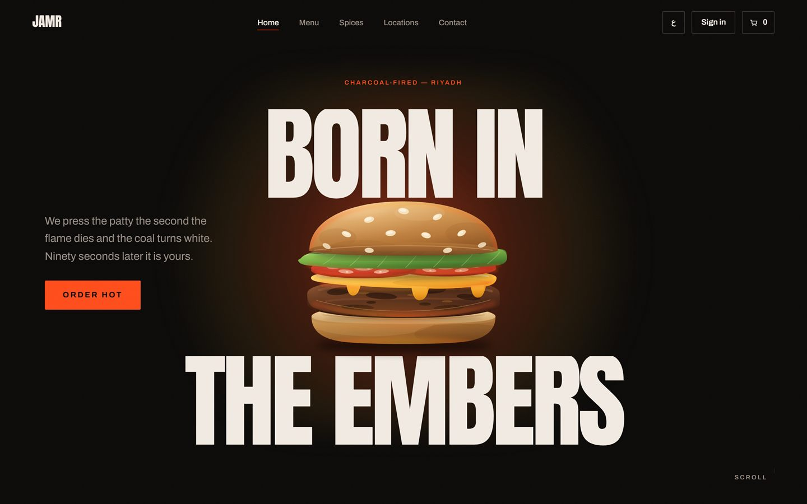
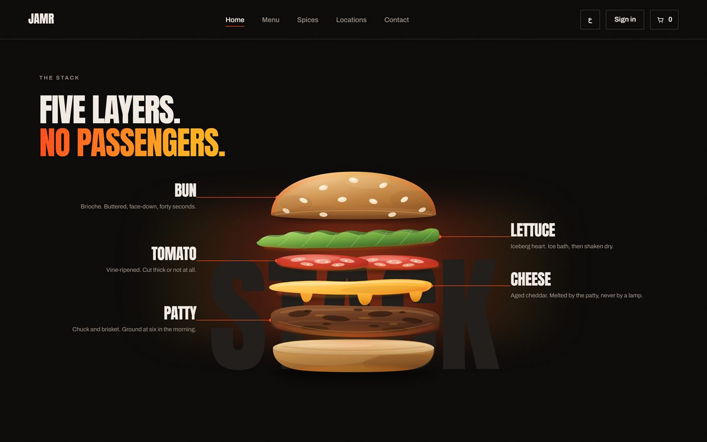
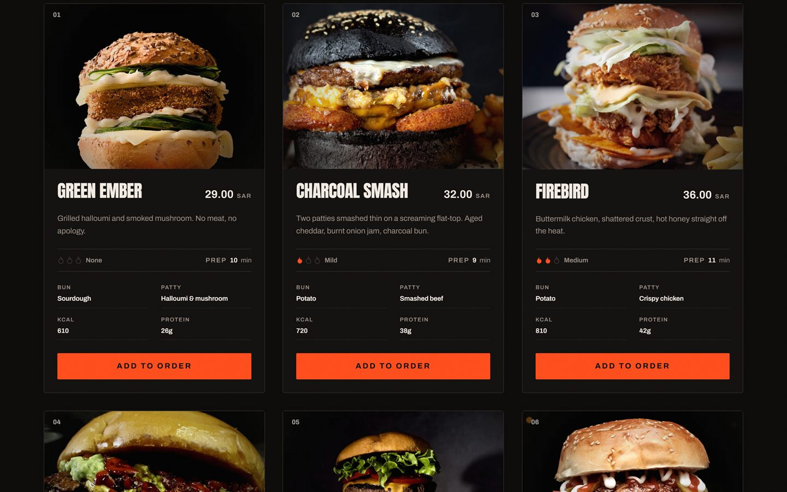

<div align="center">

# JAMR · جمر

**A charcoal-fired burger house that lives on the web.**
Bilingual (AR/EN · RTL), scroll-driven, and wired to a real Postgres loyalty ledger.

Next.js 15 · TypeScript · GSAP · Supabase · Tailwind v4



</div>

---

## What this is

A from-scratch build, in the spirit of [cravburgers.shop](https://www.cravburgers.shop/)
(Awwwards SOTD). It is a **personal learning exercise** — a study in motion design and
transactional correctness, not a commercial product and not a real store.

The reference informed the **structure, the motion language, and the level of polish**.
Nothing else was taken: the name, the brand, the copy, the palette, the type, the
illustrations and the story are all original. No asset is scraped from or hotlinked to
the reference at build time or runtime.

**There is no payment.** Checkout is simulated end to end and says so on screen.

## Preview

| The signature scroll moment | The menu |
|---|---|
|  |  |

The burger sits closed, then separates into five labelled layers as you scroll — pinned on
desktop, degrading to a stacked reveal on mobile, and appearing in its final state under
`prefers-reduced-motion`.

## Features

- **Bilingual AR/EN with real RTL.** `<html lang dir>` flips; layout is built on logical
  properties (`ms-*`/`me-*`/`start`/`end`), so RTL is a direction flip rather than a
  rewrite. Every horizontal animation inverts its axis. No user-facing string is hardcoded
  in a component — copy lives in `src/i18n/{ar,en}.ts`.
- **Scroll choreography.** GSAP + ScrollTrigger, smooth-scrolled by Lenis. Every timeline
  is built inside a `gsap.context()` and reverted on cleanup, so nothing leaks across
  route changes.
- **Auth** — email + password via Supabase, in the brand's own identity.
- **Ordering** — product grid, cart drawer, and a simulated checkout.
- **Loyalty** — every 5 confirmed orders issues one 50%-off reward. The client *displays*
  progress and never computes it.
- **Accessibility** — AA contrast, visible focus rings, semantic HTML, keyboard
  navigation, and `prefers-reduced-motion` honoured on every animation.

## The parts worth reading

This project's interesting problems were not in the UI. They were in the seams.

**The loyalty ledger is a database function, not application code.** `place_order` and
`confirm_order` are `SECURITY DEFINER` Postgres RPCs that run in one transaction. The
client sends *product ids and quantities* — never a price, a discount, a total, or a user
id. The server recomputes the subtotal from the `products` table, locks the reward row with
`SELECT … FOR UPDATE`, and returns the order with its items in a single round trip.

Verified against a live database, not by reading:

- confirming the same order twice moves the counter by **exactly 1** (idempotent);
- five confirmed orders issue **exactly one** reward;
- two concurrent redemptions of one reward — **exactly one wins**, the loser gets
  `REWARD_UNAVAILABLE` without blocking;
- confirming another user's order returns `ORDER_NOT_FOUND` — existence is not leaked;
- a double-clicked checkout leaves **one** order, via a unique index on
  `(user_id, client_token)`;
- the invariant `live_rewards == floor(confirmed_orders_count / 5)` returns **zero rows**.

That last one is a single query that catches *any* violation of the ledger, rather than a
list of scenarios someone thought of.

**RLS on every table.** Users read and write only their own rows; `products` is
world-readable and nobody-writable. A user cannot raise their own
`confirmed_orders_count` — that is a column grant, because RLS alone cannot restrict a
column. **The service-role key is not used anywhere in this project** and never appears in
a `NEXT_PUBLIC_*` variable. `profiles` rows are created by a Postgres trigger on
`auth.users`, never by the app — the alternative would require the service-role key in
application code.

**One owner per artefact.** Two scripts once wrote the same six product images; a re-run of
the loser silently reverted the site with a green exit code. `scripts/product-photos.mjs`
is now the sole owner of `public/products/*.jpg`, and the other script writes to a
throwaway directory and *cannot* touch them.

Decisions that cost something are written down in [`docs/adr/`](docs/adr/) — including
[why the ingredient showcase stays on vector art](docs/adr/0001-ingredient-showcase-art.md),
which is a record of an experiment that **failed** and why.

## Tech stack

| Layer | Choice |
|---|---|
| Framework | Next.js 15 (App Router, React Server Components) |
| Language | TypeScript — `tsc --noEmit` clean, no `any`, no `as` on external data |
| Styling | Tailwind CSS v4 (`@theme`) over CSS custom properties |
| Motion | GSAP + ScrollTrigger, Lenis for smooth scroll |
| Backend | Supabase — Postgres, Auth, RLS, `SECURITY DEFINER` RPCs |
| Validation | Zod — external data is *parsed*, never asserted |
| Tooling | Playwright (screenshots), ESLint |

## Getting started

**Prerequisites:** Node.js 20+, npm, and a free Supabase project.

```bash
git clone https://github.com/7KM-69/jamr-burgers.git
cd jamr-burgers
npm install
```

### 1. Configure the environment

```bash
cp .env.example .env.local
```

Fill in from your Supabase dashboard (**Project Settings → API**):

```ini
NEXT_PUBLIC_SUPABASE_URL=https://<your-project>.supabase.co
NEXT_PUBLIC_SUPABASE_ANON_KEY=<your-anon-or-publishable-key>
```

> `SUPABASE_SERVICE_ROLE_KEY` is intentionally **left unset**. No module reads it. If you
> ever add it, it must stay server-only and must never be prefixed `NEXT_PUBLIC_`.

### 2. Set up the database

In the Supabase **SQL Editor**, run these in order:

```
supabase/migrations/0001_schema.sql
supabase/migrations/0002_rls.sql
supabase/migrations/0003_functions.sql
supabase/seed.sql
```

`supabase/CONTRACT.md` is the authoritative schema reference — every column, every RPC
parameter name character-for-character. `supabase-js` binds RPC arguments **by name**, so a
camelCase key fails silently at runtime with no type error; never reconstruct a name from
memory.

### 3. Run it

```bash
npm run dev          # http://localhost:3000
```

## Scripts

| Command | What it does |
|---|---|
| `npm run dev` | Dev server |
| `npm run build` | Production build |
| `npm start` | Serve the production build |
| `npm run lint` | ESLint |
| `npm run typecheck` | `tsc --noEmit` |
| `npm run shot <slug>` | Screenshot a section at both viewports, both languages |
| `npm run product-photos` | Re-fetch and re-grade the six menu photographs |
| `npm run validate-layer-art` | Prove the burger layer art still closes |

## Project structure

```
src/
  app/                 # App Router — routes, layouts, route handlers
  components/
    burger/            # Layer stack + geometry for the ingredient showcase
    cart/              # Cart drawer
    chrome/            # Nav, footer, loader, page transitions
    sections/          # Home page sections, in scroll order
  i18n/                # ar.ts · en.ts — every user-facing string
  lib/
    actions/           # Server actions
    server/            # Server-side data access (the only .rpc() call site)
    supabase/          # Client/server/middleware Supabase factories
    types/             # The contract the UI binds to
    brand.ts           # The brand name lives here, and only here
supabase/
  migrations/          # Schema · RLS · functions
  seed.sql             # The six products — the authoritative slugs
  CONTRACT.md          # Literal schema handoff
scripts/               # Screenshots, image pipeline, art validation
docs/adr/              # Architecture decision records
```

## Credits

Menu photography is from [Pexels](https://www.pexels.com/license/) under the Pexels
licence, credited per-photo in [`public/products/CREDITS.md`](public/products/CREDITS.md).
Burger layer illustrations are original.

## Licence

Released under the [MIT Licence](LICENSE). The brand name *JAMR / جمر*, its copy, and its
artwork are the author's own.
